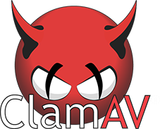

# ClamAV Windows UI

<p align="center">
  
</p>

[](LICENSE)
[](https://www.microsoft.com/windows)
[](https://dotnet.microsoft.com/download/dotnet-framework/net48)
[](../../releases/latest)
[](../../releases)
[](../../actions/workflows/tests.yml)


A lightweight **graphical interface for [ClamAV](https://www.clamav.net/) on
Windows** — on-demand scans, automatic signature updates, new-file monitoring,
USB checks and a neutralized quarantine under one portable dashboard.

The app itself is a single ~380 KB exe with **zero dependencies and zero
toolchains**: it builds with the `csc.exe` compiler already present in Windows
(.NET Framework 4.8). ClamAV and its signature database are downloaded
automatically on first run (~330 MB) and kept updated. Interface in **English**
and **Ukrainian**, switchable anytime without a restart. It lives in the tray
with no background services registered, nothing is installed system-wide, and
admin rights are never required — delete the folder and it's gone.

<p align="center">
  
  
</p>
<p align="center">
  
  
</p>

## Quick start

1. Download `ClamAVUI.exe` from the [latest release](../../releases/latest).
2. Run it. The first start asks once: install per-user (shortcuts, an "Apps"
   entry, no admin rights) or stay portable — a single folder you can carry
   around on a stick.
3. That's it. ClamAV with its signature database (~330 MB) is downloaded
   automatically; the app keeps it updated and updates itself from GitHub
   Releases.

If a `clamav` folder is already sitting next to the exe, it is used as-is and
carried along if you install later.

### "Windows protected your PC" warning

Downloading a release may trigger a SmartScreen / browser warning: the
executable is not code-signed, so every new release is an unknown file with
zero reputation for Windows. This is a reputation notice, not a detection —
each release is built from this repository by the public
[Release workflow](.github/workflows/release.yml). To run it anyway:
**More info → Run anyway**.

On Windows 11 with **Smart App Control** enabled the app is blocked outright —
Smart App Control allows only signed or well-known binaries and has no per-app
exceptions. It can only be switched off entirely (Windows Security → App &
browser control → Smart App Control; one-way — a Windows reset is needed to
re-enable it).

## What it can do

- Scan a file, a folder, or the **whole PC**; **Scan RAM** (live process
  memory — catches injected or unpacked code masked on disk); a **quick scan**
  of common infection points; and scheduled quick scans (daily / weekly, with
  catch-up if the PC was off)
- **Auto-check of new files**: Downloads, Desktop, Program Files, `%TEMP%`,
  AppData and more are monitored — a new file appears, it is scanned
  automatically and the result lands in a tray notification
- **Threat handling your way**: a per-file choice of quarantine / delete /
  exclude — or silent auto-quarantine
- **Neutralized quarantine**: captured files are XOR-transformed `.quar` blobs
  that can't run and don't trip other antiviruses; the page offers search,
  sortable columns, threat name, origin path, and the original content's
  SHA256 — restore, delete, or restore straight to exclusions, all reversible
- **clamd engine while scanning**: the daemon loads the database into memory
  once and several `clamdscan` workers scan in parallel, then it shuts down —
  resident only for the duration of the scan (falls back to `clamscan`
  automatically)
- **Fast by default**: risky file types only, a 200 MB per-file cap, and scan
  performance modes (Low / Normal / High) — all switchable in Settings
- **Pause protection** from the tray (1 / 2 / 5 hours or until restart):
  monitoring, scheduled and USB checks stop; any restart restores protection
- One-click database updates with a **stale-database warning**, app
  self-update from GitHub Releases, USB scan offer, exclusions, and a
  color-coded log with live progress — plus a **recent activity** list on the
  dashboard with the full log one click away

## Why this project?

Windows Defender is excellent, and this project is not intended to replace it.
It is a lightweight power-tool for people who want a second, fully
open-source scanner they control end to end: the official, unmodified ClamAV
binaries driven by a portable dashboard written entirely in C# — no services,
no telemetry, no admin rights, and nothing left on the system when you delete
the folder.

## For developers

The whole app builds with the `csc.exe` compiler already present in Windows —
no toolchain, no NuGet, one command:

```powershell
.\build.ps1
```

Architecture, the scan pipeline, install layout, project structure, and
contributor constraints live in **[README.DEV.md](README.DEV.md)** (and
`AGENTS.md` for AI-agent specifics).

## License

[Apache License 2.0](LICENSE) — free to use, modify, and distribute,
including commercially.

ClamAV® is a registered trademark of Cisco Systems, Inc. and is licensed
separately under GPLv2. This project is an independent open-source interface
that runs the official, unmodified ClamAV binaries as separate processes; it
does not bundle or link against ClamAV code.
