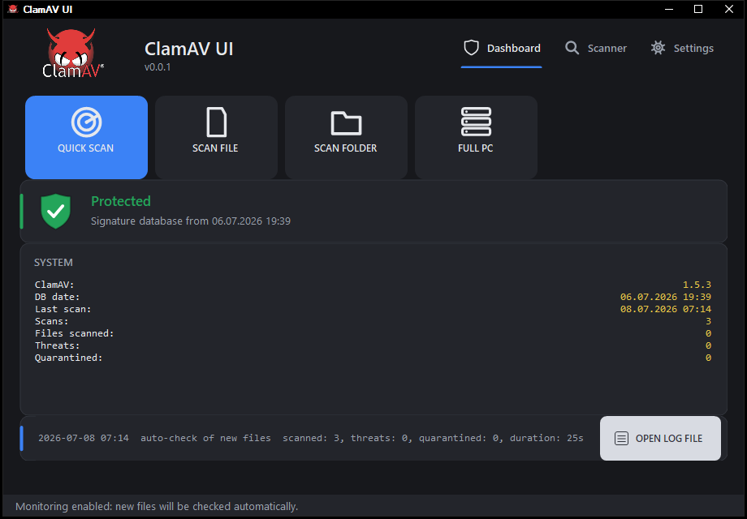
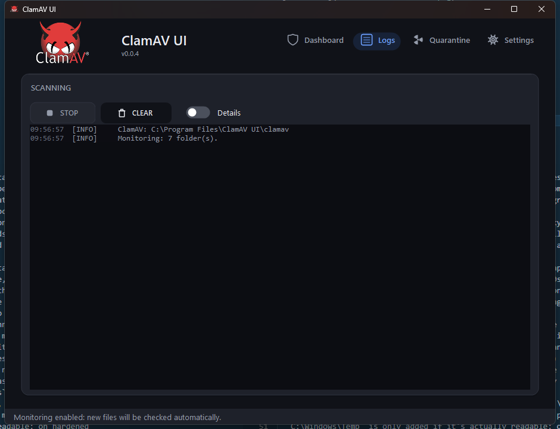
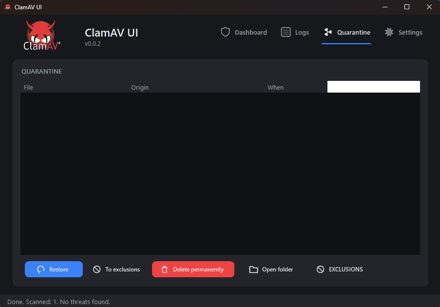
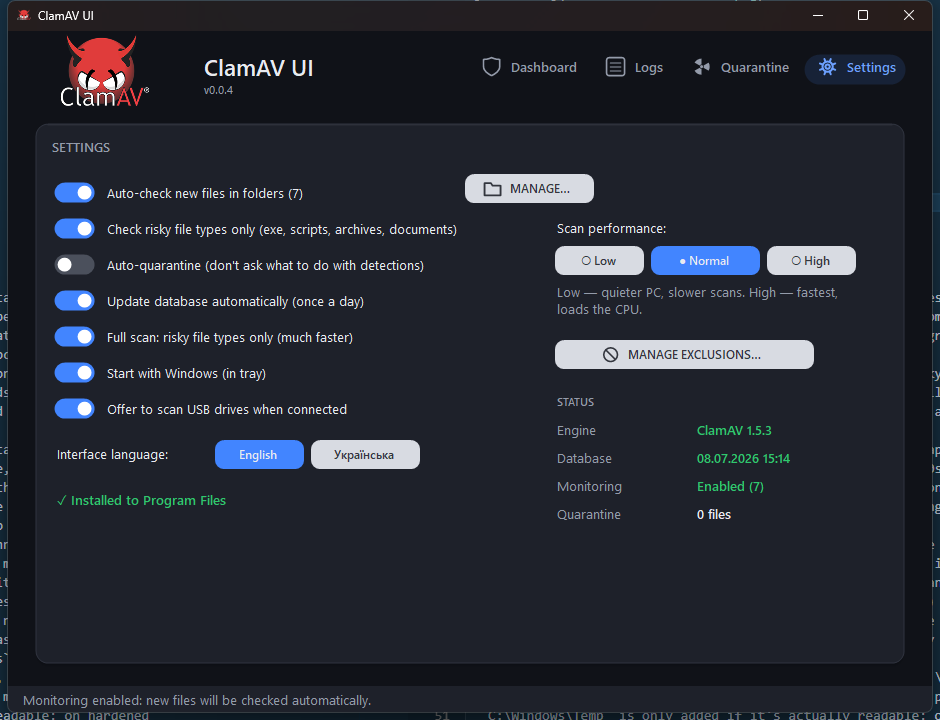

# ClamAV Windows UI

A lightweight graphical interface for [ClamAV](https://www.clamav.net/) on Windows.
Single-file source, ~300 KB exe, **zero dependencies and zero toolchains** — builds
with the `csc.exe` compiler already built into Windows (.NET Framework 4.8, present
on Win10/11).

The interface is available in **English** (default) and **Ukrainian**, switchable
anytime from Settings — no restart required.

| Dashboard | Logs | Quarantine | Settings |
| --- | --- | --- | --- |
|  |  |  |  |

## Features

- Scan a file, a folder, or the **whole PC** (all local drives) via `clamscan`
- **Quick scan** (minutes, not hours): risky file types in common infection
  points — Downloads, Desktop, Documents, Temp, AppData, ProgramData, startup
  folders — plus the executables of every running process
- **Fast full scan**: by default a full scan checks only risky file types
  (exe, scripts, archives, documents) — the app builds the file list itself,
  so the scanner doesn't waste time on gigabyte-sized videos and images;
  scanning **all** files can be enabled in Settings
- **clamd engine while scanning**: before a manual scan the app starts the
  `clamd` daemon (the database loads into memory once, ~20-30s), scans with
  several parallel `clamdscan` processes, and stops the daemon immediately
  afterwards — it stays resident in memory only while scanning. Falls back
  to plain `clamscan` automatically if clamd fails to start
- **Exclusions**: a list of paths that are never scanned (the "Exclusions…"
  button; passed as `--exclude`/`--exclude-dir`, the monitor ignores them too)
- Live log: infected files are highlighted in red, with a scan summary
- Signature database updates with one click (via `freshclam`)
- **Auto-check for new files**: monitors folders — a new file appears →
  it's scanned automatically, with the result shown as a tray notification.
  Default folders: Downloads, Desktop, `Program Files` and
  `Program Files (x86)`, `%TEMP%`, `AppData\Roaming`, and `C:\Windows\Temp`
  (common places droppers get extracted to and where malware persists).
  `C:\Windows\Temp` is only added if it's actually readable: on hardened
  systems a non-elevated process can be denied even read access to it, so
  the app checks first and skips it there instead of letting the
  `FileSystemWatcher` fail. Settings offers a one-click fix to restore
  access on such machines, after which it's watched automatically.
  By default only **potentially dangerous file types** are scanned (exe,
  dll, scripts, installers, archives, documents with macros) — the filter
  can be turned off in Settings
- **Threat handling**: when something is found, a dialog lets you choose an
  action per file: **quarantine / delete / exclude**. The "Auto-quarantine"
  checkbox moves files without asking (`clamscan --move`)
- **Quarantine**: view, restore, permanently delete, or restore straight
  **to exclusions** (so it's never flagged again)
- **Exclusions**: a file can be removed from the exclusion list, deleted
  from disk, or sent **to quarantine**
- **Statistics**: number of scans, threats found, and files in quarantine
- Autostart with Windows — **enabled automatically on first run**
  (`HKCU\...\Run` registry key, starts in the tray); the checkbox can be
  cleared, and the app won't turn it back on
- **Single instance**: launching it again doesn't open a second window, it
  brings the running instance forward instead (mutex + broadcast message)
- Tray icon: the close button minimizes to tray, with notifications for
  scan results
- Modern dark theme with icon buttons (custom-drawn vector glyphs, no image
  assets or third-party UI libraries)
- **Daily database version checks** instead of hammering the server every
  30 minutes: a lightweight check runs once a day, and if a newer database
  is available, the app notifies via the tray and downloads it automatically
  (or shows an "Update Database" button if auto-update is off). If the
  update server responds with HTTP 429 (rate limited), the app backs off
  for a while instead of retrying immediately
- **Self-updating**: once a day the app also checks this repo's latest
  GitHub Release; if it's newer, it downloads the new `ClamAVUI.exe`,
  shows a tray notification, and swaps itself in on restart — no manual
  download needed. Works in both portable and installed-to-Program-Files
  mode (no admin prompt)

## Building

```powershell
.\build.ps1
```

The script calls `C:\Windows\Microsoft.NET\Framework64\v4.0.30319\csc.exe` —
nothing needs to be installed. Output: `ClamAVUI.exe`.

## Installing on a new PC

Just **copy the single `ClamAVUI.exe`** into any folder and run it.
The app offers two options:

- **Install to Program Files** (one UAC prompt): the exe is copied to
  `C:\Program Files\ClamAV UI`, ClamAV is downloaded from GitHub there
  (~220 MB) along with the signature database; Start Menu and Desktop
  shortcuts are created, and the app appears in "Programs and Features"
  with an uninstall option. Folder permissions are managed via `icacls` so
  the database can update without admin rights.
- **Portable mode**: everything downloads into the current folder, no
  traces left on the system.

Installing to Program Files can also be done later — there's a button in
Settings. If ClamAV is already sitting next to the exe in a `clamav`
folder, the app will use it as-is, and will carry it along with the
database and quarantine during installation (nothing is downloaded again).

## Releases

`.github/workflows/release.yml` builds `ClamAVUI.exe` and publishes it as a
GitHub Release whenever `AssemblyVersion` in `ClamUI.cs` changes on `main`
(bump the version, push, and a `vX.Y.Z` tag + release with the exe attached
appear automatically). It no-ops if that version was already released, and
can also be triggered manually from the Actions tab.

## Structure

```
ClamUI.cs      — the entire application (WinForms, C# 5)
clamav.ico     — app icon (exe + window + tray), ClamAV logo
logo.png       — header logo (embedded in the exe as a resource)
build.ps1      — builds the app with the built-in csc.exe
settings.ini   — settings and statistics (created automatically)
quarantine/    — quarantine: infected files + index.txt with origin paths
clamav/        — portable ClamAV (not in git, downloaded separately)
ClamAVUI.exe   — build output (not in git)
```

> **Warning:** files under `quarantine/` are infected and moved there as-is.
> Don't run anything from that folder; delete or restore files via the UI.

## How monitoring works

A `FileSystemWatcher` watches the configured folders (the **"Folders…"**
button). New files are queued with a 3s debounce (so a file has time to
finish being written; temporary extensions like `.crdownload`/`.part` are
ignored until they're renamed), then scanned together in one `clamscan`
batch. If a threat is found, the window is restored and a warning is shown.
